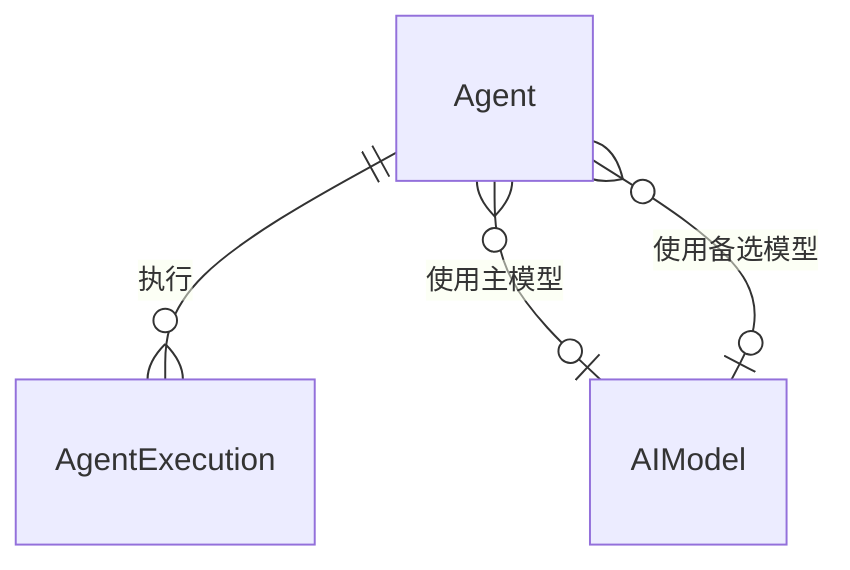

# Agent 域 - 实体定义

> **层级**：L3 详细内容
> **大小**：< 5KB

## 核心实体

### Agent（智能体）

**数据库表**：`agents`

| 字段 | 类型 | 必填 | 说明 |
|------|------|------|------|
| id | TEXT (UUID) | 是 | 主键 |
| name | TEXT | 是 | Agent 名称 |
| avatar | TEXT | 否 | 头像 URL |
| role | TEXT | 否 | 角色描述 |
| system_prompt | TEXT | 否 | 系统提示词 |
| model | TEXT | 否 | 默认模型 |
| temperature | REAL | 否 | 温度参数 (0-1) |
| enabled | INTEGER | 是 | 是否启用 (0/1) |
| is_preset | INTEGER | 是 | 是否预设 (0/1) |
| category | TEXT | 否 | 分类 |
| tags | TEXT (JSON) | 否 | 标签数组 |
| description | TEXT | 否 | 描述 |
| api_provider | TEXT | 否 | API 提供商 |
| primary_model_id | TEXT | 否 | 主模型 ID |
| fallback_model_id | TEXT | 否 | 备选模型 ID |
| usage_count | INTEGER | 否 | 使用次数 |
| last_used_at | DATETIME | 否 | 最后使用时间 |
| created_at | DATETIME | 是 | 创建时间 |
| updated_at | DATETIME | 否 | 更新时间 |

**预设 Agent 列表**：

| 名称 | 类别 | 功能 |
|------|------|------|
| 告警处理 Agent | alert | 解析告警、评估严重程度 |
| 故障诊断 Agent | diagnostic | 分析故障原因、提供排查步骤 |
| 日志分析 Agent | analysis | 解析日志、识别错误模式 |
| 系统巡检 Agent | inspection | 系统健康检查 |
| 变更执行 Agent | execution | 执行系统变更操作 |
| 文档生成 Agent | documentation | 生成运维报告 |
| 合规检查 Agent | compliance | 安全合规检查 |
| 服务器命令执行 Agent | server | 执行服务器命令 |
| 自动巡检 Agent | inspection | 批量服务器巡检 |
| 数据库运维 Agent | database | 数据库诊断/监控 |

### AgentExecution（执行记录）

**数据库表**：`agent_executions`

| 字段 | 类型 | 必填 | 说明 |
|------|------|------|------|
| id | TEXT (UUID) | 是 | 主键 |
| agent_id | TEXT | 是 | Agent ID |
| agent_name | TEXT | 是 | Agent 名称 |
| input_text | TEXT | 是 | 输入文本 |
| output_text | TEXT | 否 | 输出文本 |
| status | TEXT | 是 | 状态 (success/error) |
| error_message | TEXT | 否 | 错误信息 |
| execution_time_ms | INTEGER | 否 | 执行时间 (ms) |
| metadata | TEXT (JSON) | 否 | 元数据 |
| created_at | DATETIME | 是 | 创建时间 |

### AIModel（AI 模型）

**数据库表**：`ai_models`

| 字段 | 类型 | 必填 | 说明 |
|------|------|------|------|
| id | TEXT (UUID) | 是 | 主键 |
| name | TEXT | 是 | 模型名称 |
| provider_type | TEXT | 是 | 提供商类型 |
| model_id | TEXT | 是 | 模型 ID |
| api_key | TEXT | 否 | API 密钥 (加密) |
| api_base | TEXT | 否 | API 地址 |
| enabled | INTEGER | 是 | 是否启用 |
| is_default | INTEGER | 是 | 是否默认模型 |
| priority | INTEGER | 否 | 优先级 |
| created_at | DATETIME | 是 | 创建时间 |

## 实体关系

---

*生成时间：2026-06-21*
