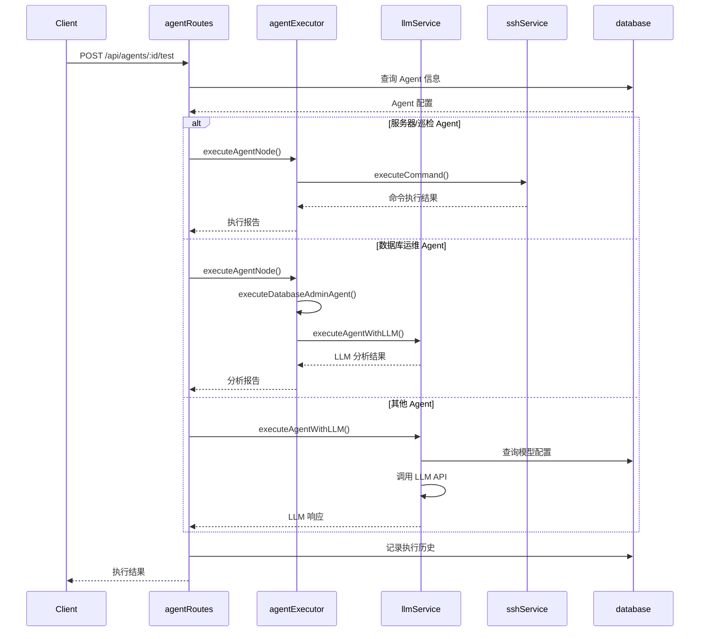
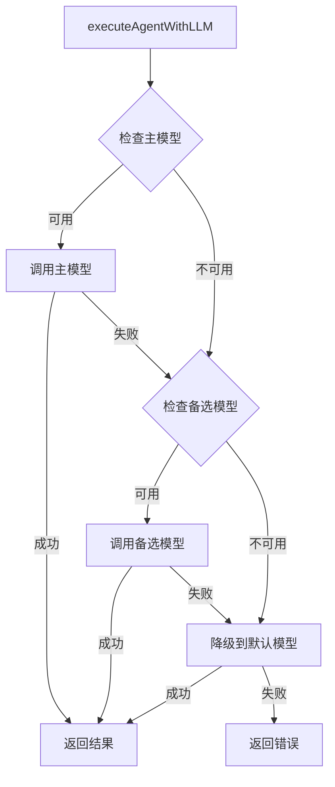
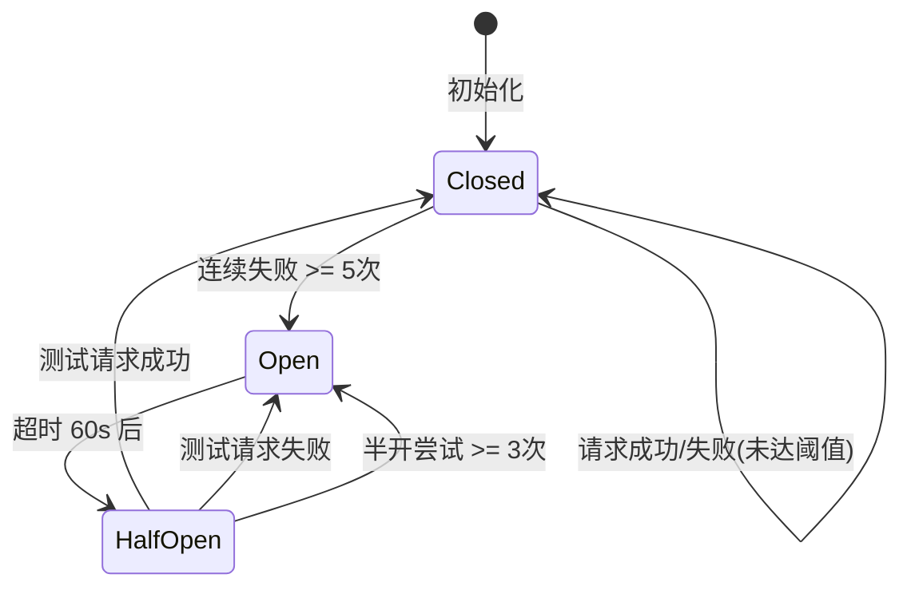

# Agent 域 - 业务流程

> **层级**：L3 详细内容
> **大小**：< 5KB

## Agent 执行流程

## LLM 调用流程

## 熔断器状态机

## 关键决策点

### 1. Agent 类型判断

根据 Agent 名称关键词判断执行路径：

| 关键词 | 执行路径 |
|--------|----------|
| 服务器/命令 | `executeServerCommandAgent` |
| 巡检/自动 | `executeAutoInspectionAgent` |
| 数据库 | `executeDatabaseAdminAgent` |
| 其他 | `executeAgentWithLLM` (LLM 调用) |

### 2. 模型选择策略

1. 优先使用 Agent 配置的 `primary_model_id`
2. 主模型失败则尝试 `fallback_model_id`
3. 最后降级到 AI 模型池的默认模型
4. 向后兼容：使用旧的 `api_provider` 配置

### 3. 超时处理

- Agent 执行超时：5 分钟 (`AGENT_EXECUTION_TIMEOUT`)
- LLM API 调用超时：60 秒
- 重试策略：最多 3 次，指数退避

---

*生成时间：2026-06-21*
