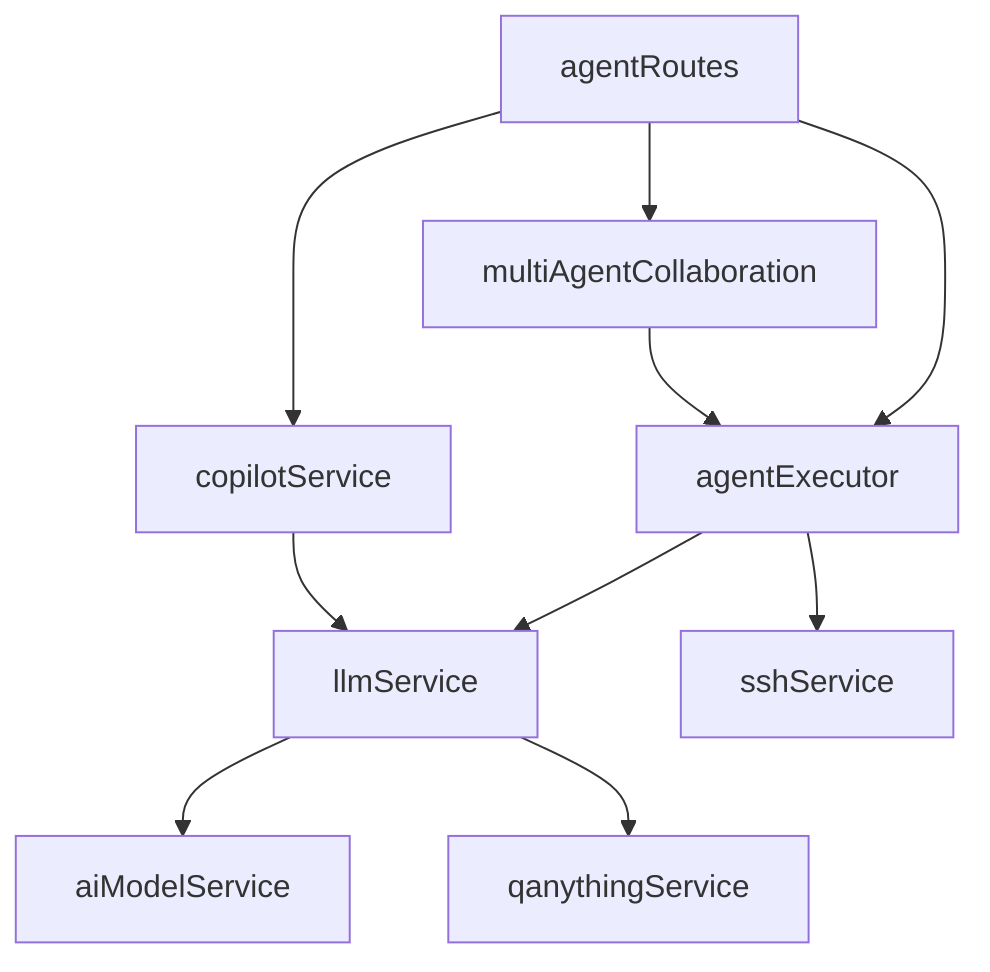

# Agent 域 - 服务接口

> **层级**：L3 详细内容
> **大小**：< 5KB

## 核心服务

### agentExecutor.ts

**文件位置**：`backend/src/services/agentExecutor.ts`

#### 核心函数

```typescript
// 执行 Agent 节点
export async function executeAgentNode(
  agentId: string,
  input: string,
  context?: Record<string, unknown>
): Promise<string>

// 获取思考步骤
export function getThinkingSteps(agentName: string): string[]
```

**内部函数**：

```typescript
// 服务器命令执行 Agent
async function executeServerCommandAgent(
  input: string,
  context?: Record<string, unknown>
): Promise<string>

// 自动巡检 Agent
async function executeAutoInspectionAgent(
  input: string,
  context?: Record<string, unknown>
): Promise<string>

// 数据库运维 Agent
async function executeDatabaseAdminAgent(
  agentId: string,
  input: string,
  context?: Record<string, unknown>
): Promise<string>
```

### llmService.ts

**文件位置**：`backend/src/services/llmService.ts`

#### 核心函数

```typescript
// 调用 Agent + LLM
export async function executeAgentWithLLM(
  agentId: string,
  userInput: string
): Promise<string>

// 通用 LLM 完成
export async function generateCompletion(
  prompt: string,
  systemPrompt?: string,
  temperature?: number,
  model?: string,
  agentId?: string
): Promise<string>

// 检查 LLM 可用性
export async function checkLLMAvailability(): Promise<{
  available: boolean;
  message: string;
  provider?: string;
}>
```

#### 熔断器

```typescript
class CircuitBreaker {
  canCall(): boolean
  recordSuccess(): void
  recordFailure(): void
}

// 启动清理
export function startCircuitBreakerCleanup(): void
export function stopCircuitBreakerCleanup(): void
export function getCircuitBreakerStats(): object
```

### aiModelService.ts

**文件位置**：`backend/src/services/aiModelService.ts`

#### 核心函数

```typescript
// 获取所有模型
export function getAllModels(): AIModel[]

// 获取启用的模型
export function getEnabledModels(): AIModel[]

// 获取默认模型
export function getDefaultModel(): AIModel | null

// 根据 ID 获取模型
export function getModelById(id: string): AIModel | null

// 获取有效 API Key
export function getEffectiveApiKey(model: AIModel): string

// 获取有效 API Base
export function getEffectiveApiBase(model: AIModel): string
```

### multiAgentCollaboration.ts

**文件位置**：`backend/src/services/multiAgentCollaboration.ts`

#### 核心函数

```typescript
// 多 Agent 协作执行
export async function executeMultiAgentTask(
  task: string,
  agentIds: string[],
  context?: Record<string, unknown>
): Promise<MultiAgentResult>
```

### copilotService.ts

**文件位置**：`backend/src/services/copilotService.ts`

#### 核心函数

```typescript
// Copilot 对话
export async function chat(
  message: string,
  conversationId?: string
): Promise<CopilotResponse>

// 获取对话历史
export function getConversationHistory(
  conversationId: string
): ChatMessage[]
```

## 服务调用关系



---

*生成时间：2026-06-21*
