# 告警域业务流程
本文档描述告警域的完整业务流程。
## 1. 告警创建流程
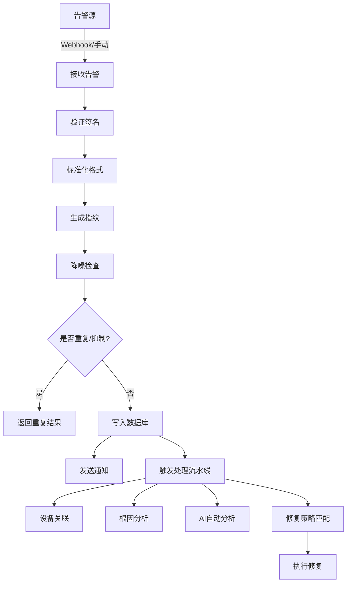
```mermaid
flowchart TD
    A[告警源] -->|Webhook/手动| B[接收告警]
    B --> C[验证签名]
    C --> D[标准化格式]
    D --> E[生成指纹]
    E --> F[降噪检查]
    F --> G{是否重复/抑制?}
    G -->|是| H[返回重复结果]
    G -->|否| I[写入数据库]
    I --> J[发送通知]
    I --> K[触发处理流水线]
    K --> L[设备关联]
    K --> M[根因分析]
    K --> N[AI自动分析]
    K --> O[修复策略匹配]
    O --> P[执行修复]
```
## 2. 告警降噪流程
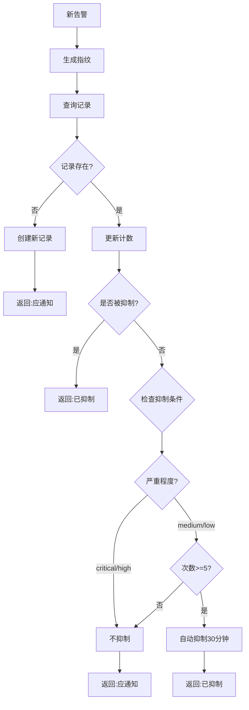
```mermaid
flowchart TD
    A[新告警] --> B[生成指纹]
    B --> C[查询记录]
    C --> D{记录存在?}
    D -->|否| E[创建新记录]
    E --> F[返回:应通知]
    D -->|是| G[更新计数]
    G --> H{是否被抑制?}
    H -->|是| I[返回:已抑制]
    H -->|否| J{检查抑制条件}
    J --> K{严重程度?}
    K -->|critical/high| L[不抑制]
    K -->|medium/low| M{次数>=5?}
    M -->|是| N[自动抑制30分钟]
    M -->|否| L
    L --> O[返回:应通知]
    N --> P[返回:已抑制]
```
## 3. 告警关联流程
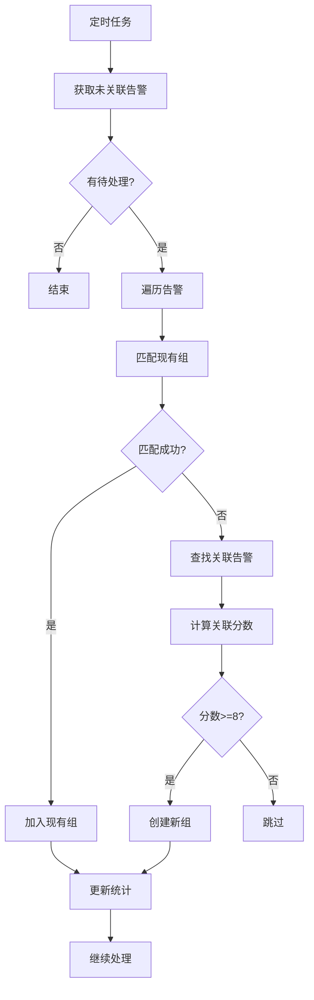
```mermaid
flowchart TD
    A[定时任务] --> B[获取未关联告警]
    B --> C{有待处理?}
    C -->|否| D[结束]
    C -->|是| E[遍历告警]
    E --> F[匹配现有组]
    F --> G{匹配成功?}
    G -->|是| H[加入现有组]
    G -->|否| I[查找关联告警]
    I --> J[计算关联分数]
    J --> K{分数>=8?}
    K -->|是| L[创建新组]
    K -->|否| M[跳过]
    H --> N[更新统计]
    L --> N
    N --> O[继续处理]
```
## 4. 自动分析流程
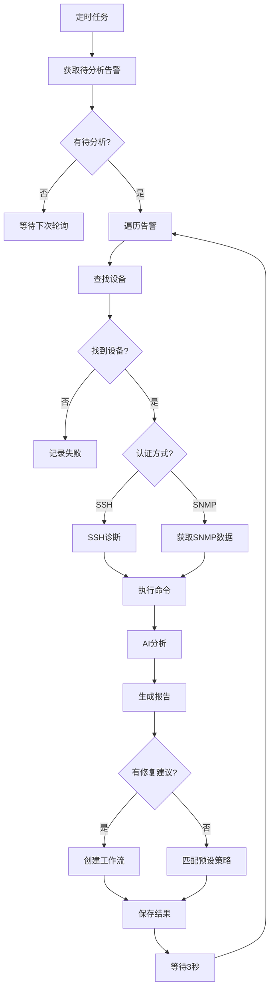
```mermaid
flowchart TD
    A[定时任务] --> B[获取待分析告警]
    B --> C{有待分析?}
    C -->|否| D[等待下次轮询]
    C -->|是| E[遍历告警]
    E --> F[查找设备]
    F --> G{找到设备?}
    G -->|否| H[记录失败]
    G -->|是| I{认证方式?}
    I -->|SSH| J[SSH诊断]
    I -->|SNMP| K[获取SNMP数据]
    J --> L[执行命令]
    K --> L
    L --> M[AI分析]
    M --> N[生成报告]
    N --> O{有修复建议?}
    O -->|是| P[创建工作流]
    O -->|否| Q[匹配预设策略]
    P --> R[保存结果]
    Q --> R
    R --> S[等待3秒]
    S --> E
```
## 5. Webhook 处理流程
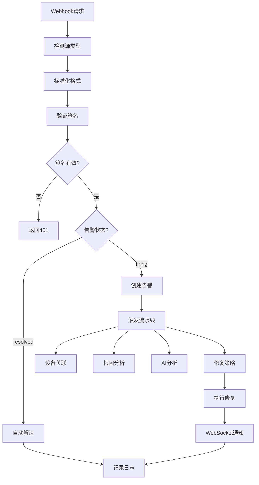
```mermaid
flowchart TD
    A[Webhook请求] --> B[检测源类型]
    B --> C[标准化格式]
    C --> D[验证签名]
    D --> E{签名有效?}
    E -->|否| F[返回401]
    E -->|是| G{告警状态?}
    G -->|resolved| H[自动解决]
    G -->|firing| I[创建告警]
    I --> J[触发流水线]
    J --> K[设备关联]
    J --> L[根因分析]
    J --> M[AI分析]
    J --> N[修复策略]
    N --> O[执行修复]
    O --> P[WebSocket通知]
    H --> Q[记录日志]
    P --> Q
```
## 6. 修复策略执行流程
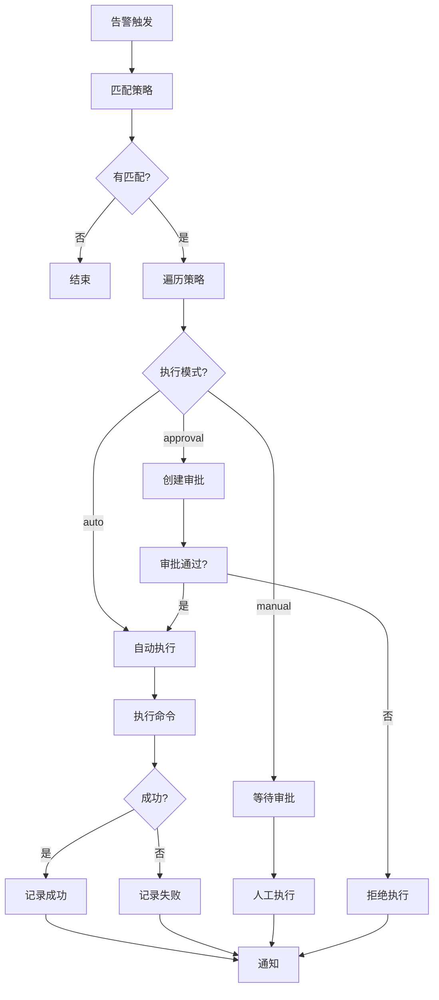
```mermaid
flowchart TD
    A[告警触发] --> B[匹配策略]
    B --> C{有匹配?}
    C -->|否| D[结束]
    C -->|是| E[遍历策略]
    E --> F{执行模式?}
    F -->|auto| G[自动执行]
    F -->|manual| H[等待审批]
    F -->|approval| I[创建审批]
    G --> J[执行命令]
    J --> K{成功?}
    K -->|是| L[记录成功]
    K -->|否| M[记录失败]
    L --> N[通知]
    M --> N
    H --> O[人工执行]
    I --> P[审批通过?]
    P -->|是| G
    P -->|否| Q[拒绝执行]
    O --> N
    Q --> N
```
## 7. 告警生命周期
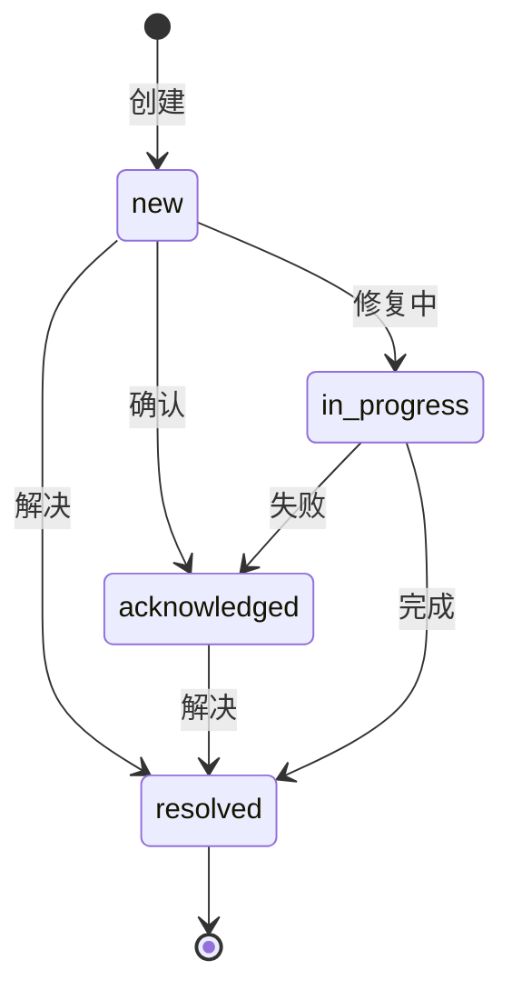
```mermaid
stateDiagram-v2
    [*] --> new: 创建
    new --> acknowledged: 确认
    new --> resolved: 解决
    acknowledged --> resolved: 解决
    resolved --> [*]
    new --> in_progress: 修复中
    in_progress --> resolved: 完成
    in_progress --> acknowledged: 失败
```
## 8. 设备诊断流程
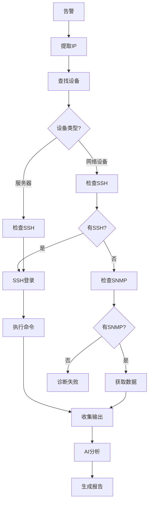
```mermaid
flowchart TD
    A[告警] --> B[提取IP]
    B --> C[查找设备]
    C --> D{设备类型?}
    D -->|网络设备| E[检查SSH]
    D -->|服务器| F[检查SSH]
    E --> G{有SSH?}
    G -->|是| H[SSH登录]
    G -->|否| I[检查SNMP]
    I --> J{有SNMP?}
    J -->|是| K[获取数据]
    J -->|否| L[诊断失败]
    H --> M[执行命令]
    M --> N[收集输出]
    K --> N
    N --> O[AI分析]
    O --> P[生成报告]
    F --> H
```
## 9. AI分析流程
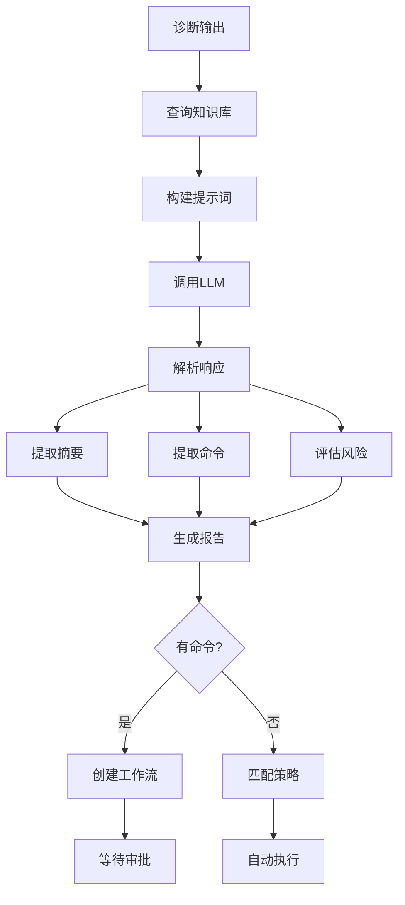
```mermaid
flowchart TD
    A[诊断输出] --> B[查询知识库]
    B --> C[构建提示词]
    C --> D[调用LLM]
    D --> E[解析响应]
    E --> F[提取摘要]
    E --> G[提取命令]
    E --> H[评估风险]
    F --> I[生成报告]
    G --> I
    H --> I
    I --> J{有命令?}
    J -->|是| K[创建工作流]
    J -->|否| L[匹配策略]
    K --> M[等待审批]
    L --> N[自动执行]
```
## 10. 告警处理流水线
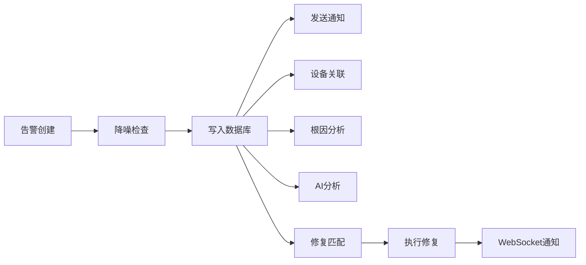
```mermaid
flowchart LR
    A[告警创建] --> B[降噪检查]
    B --> C[写入数据库]
    C --> D[发送通知]
    C --> E[设备关联]
    C --> F[根因分析]
    C --> G[AI分析]
    C --> H[修复匹配]
    H --> I[执行修复]
    I --> J[WebSocket通知]
```
## 11. 降噪记录清理
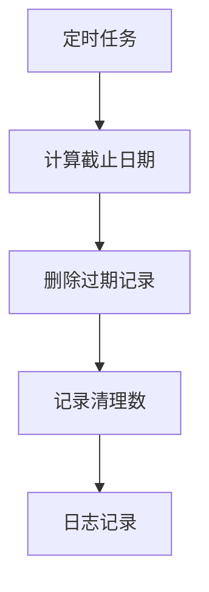
```mermaid
flowchart TD
    A[定时任务] --> B[计算截止日期]
    B --> C[删除过期记录]
    C --> D[记录清理数]
    D --> E[日志记录]
```