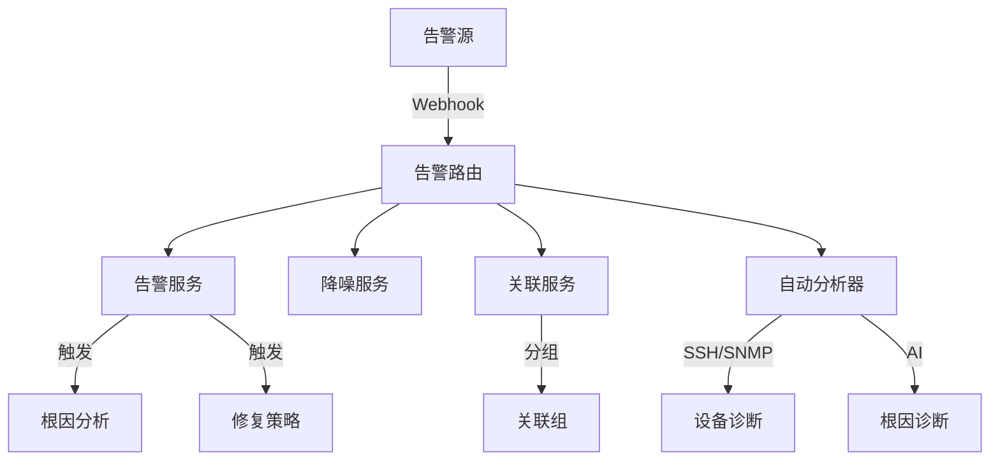

# 告警域文档索引

本文档描述 ITOps Agent Platform 的告警域相关代码，涵盖告警管理、降噪、关联分析、自动分析和 Webhook 接入等功能。

## 文档结构

| 文件 | 描述 |
|------|------|
| [entities.md](entities.md) | 告警域实体定义，包括告警、规则、降噪记录、关联组等数据结构 |
| [services.md](services.md) | 告警域核心服务接口，包括告警服务、降噪服务、关联服务和自动分析器 |
| [apis.md](apis.md) | 告警域 API 端点定义，包括告警管理和 Webhook 接入的 RESTful API |
| [flows.md](flows.md) | 告警域业务流程图，描述告警处理、降噪、关联分析和自动分析的完整流程 |

## 告警域概述

告警域负责管理告警的全生命周期，主要包含以下核心功能：

1. **告警管理** - 创建、查询、确认、解决告警
2. **告警降噪** - 去重、抑制重复告警，减少告警风暴
3. **告警关联** - 将相关告警自动归组，便于统一处理
4. **自动分析** - 通过 SSH/SNMP 诊断设备，AI 分析根因
5. **Webhook 接入** - 支持 Prometheus、Zabbix、Grafana、阿里云、腾讯云等告警源接入

## 核心服务关系



## 文件位置

```
backend/src/
├── services/
│   ├── alertService.ts          # 告警核心服务
│   ├── alertNoiseReductionService.ts  # 告警降噪服务
│   ├── alertCorrelationService.ts     # 告警关联服务
│   └── alertAutoAnalyzer.ts           # 告警自动分析器
└── routes/
    ├── alertRoutes.ts           # 告警 API 路由
    └── webhookRoutes.ts         # Webhook 接入路由
```