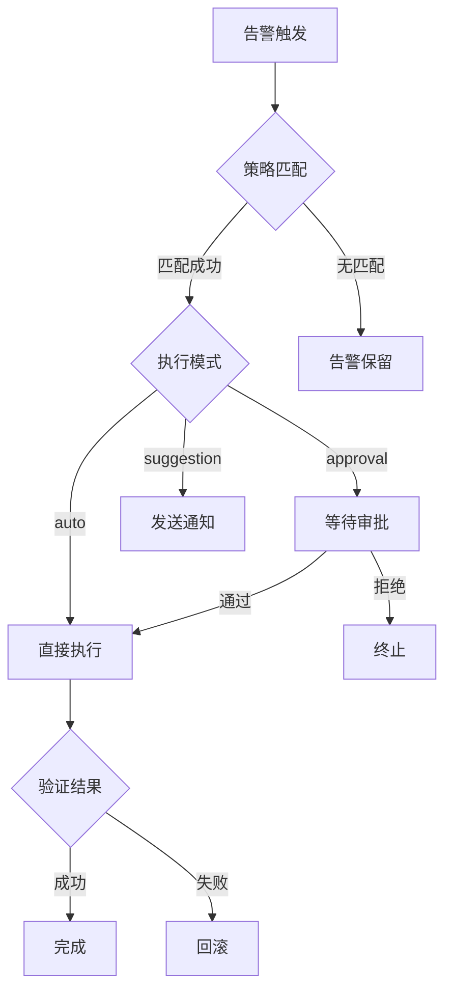
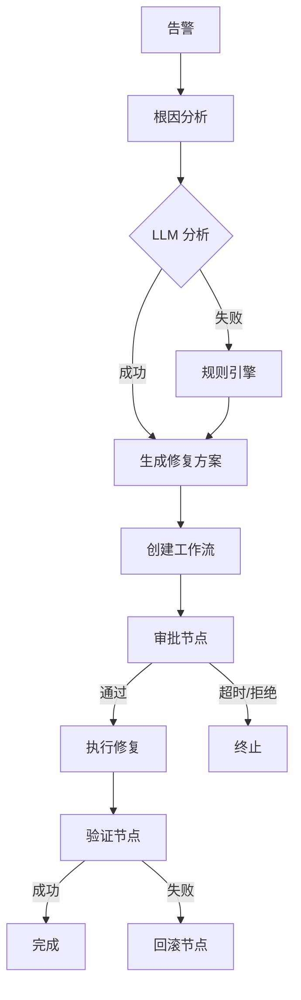

# 自动修复域 - 业务流程

> **层级**：L3 详细内容

## 策略驱动修复流程

```mermaid
flowchart TD
    A[告警触发] --> B{策略匹配}
    B -->|匹配成功| C{执行模式}
    B -->|无匹配| D[告警保留]
    C -->|auto| E[直接执行]
    C -->|approval| F[等待审批]
    C -->|suggestion| G[发送通知]
    F -->|通过| E
    F -->|拒绝| H[终止]
    E --> I{验证结果}
    I -->|成功| J[完成]
    I -->|失败| K[回滚]
```

## AI 修复流程

```mermaid
flowchart TD
    A[告警] --> B[根因分析]
    B --> C{LLM 分析}
    C -->|成功| D[生成修复方案]
    C -->|失败| E[规则引擎]
    E --> D
    D --> F[创建工作流]
    F --> G[审批节点]
    G -->|通过| H[执行修复]
    G -->|超时/拒绝| I[终止]
    H --> J[验证节点]
    J -->|成功| K[完成]
    J -->|失败| L[回滚节点]
```

---

*生成时间：2026-06-21*