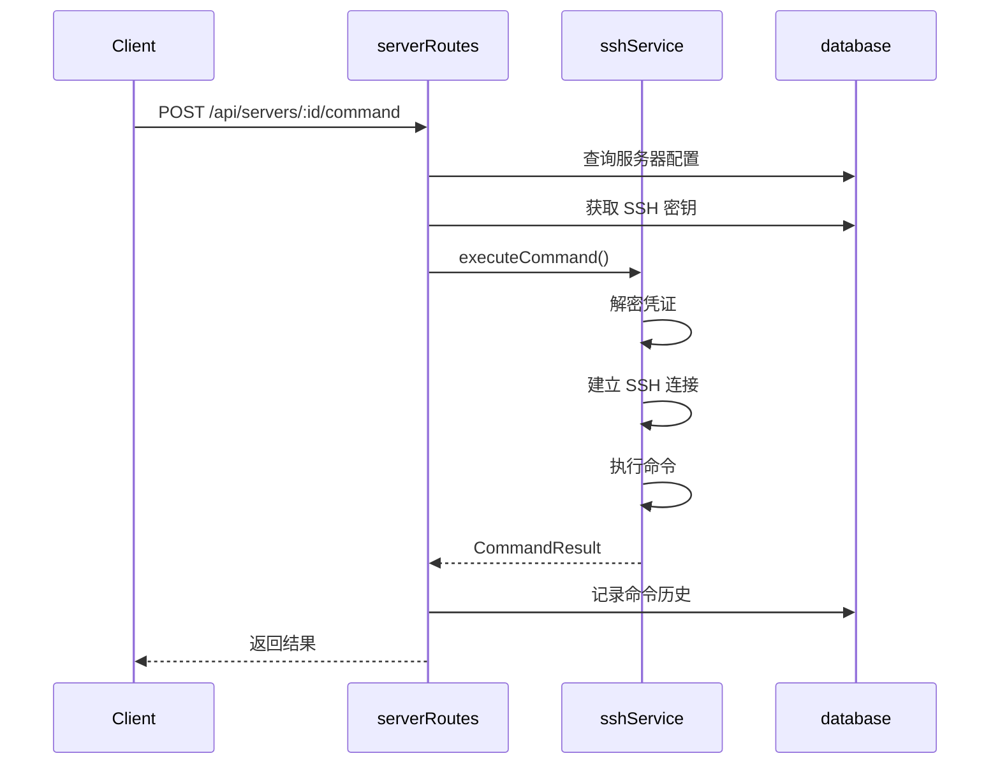
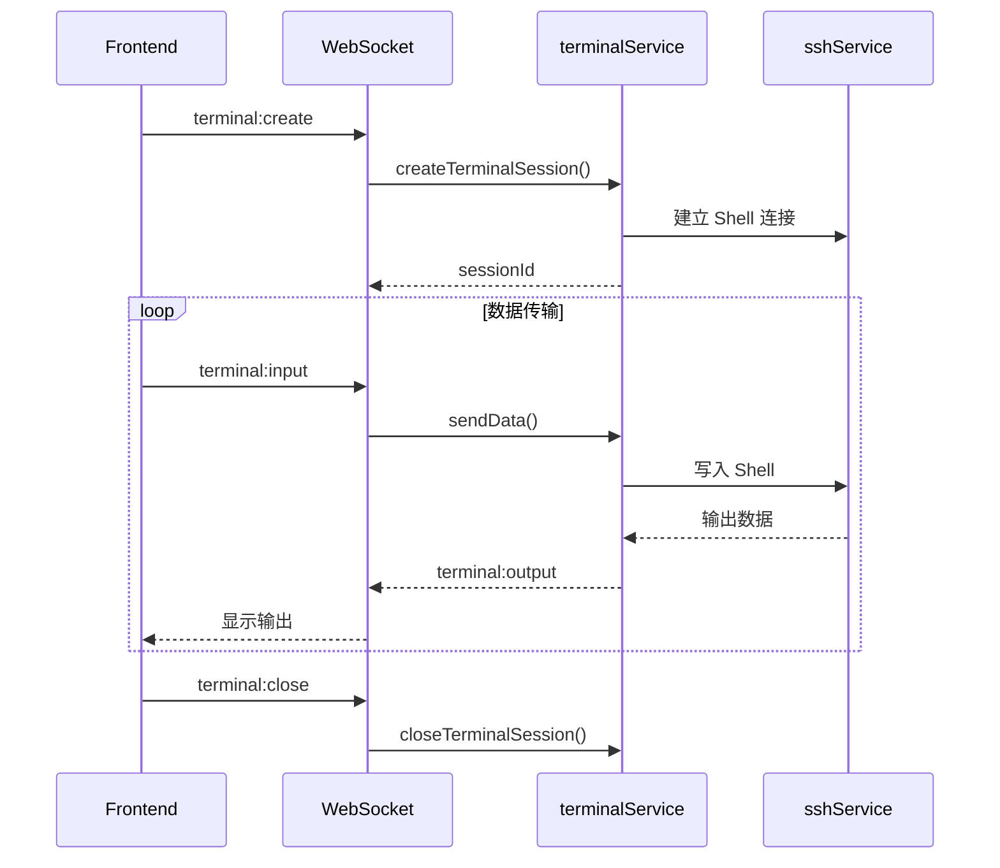

# 服务器域 - 业务流程

> **层级**：L3 详细内容

## 服务器连接流程

```mermaid
sequenceDiagram
    participant Client
    participant API as serverRoutes
    participant SSH as sshService
    participant DB as database

    Client->>API: POST /api/servers/:id/command
    API->>DB: 查询服务器配置
    API->>DB: 获取 SSH 密钥
    API->>SSH: executeCommand()
    SSH->>SSH: 解密凭证
    SSH->>SSH: 建立 SSH 连接
    SSH->>SSH: 执行命令
    SSH-->>API: CommandResult
    API->>DB: 记录命令历史
    API-->>Client: 返回结果
```

## 终端会话流程

```mermaid
sequenceDiagram
    participant Frontend
    participant WS as WebSocket
    participant Terminal as terminalService
    participant SSH as sshService

    Frontend->>WS: terminal:create
    WS->>Terminal: createTerminalSession()
    Terminal->>SSH: 建立 Shell 连接
    Terminal-->>WS: sessionId
    
    loop 数据传输
        Frontend->>WS: terminal:input
        WS->>Terminal: sendData()
        Terminal->>SSH: 写入 Shell
        SSH-->>Terminal: 输出数据
        Terminal-->>WS: terminal:output
        WS-->>Frontend: 显示输出
    end
    
    Frontend->>WS: terminal:close
    WS->>Terminal: closeTerminalSession()
```

---

*生成时间：2026-06-21*