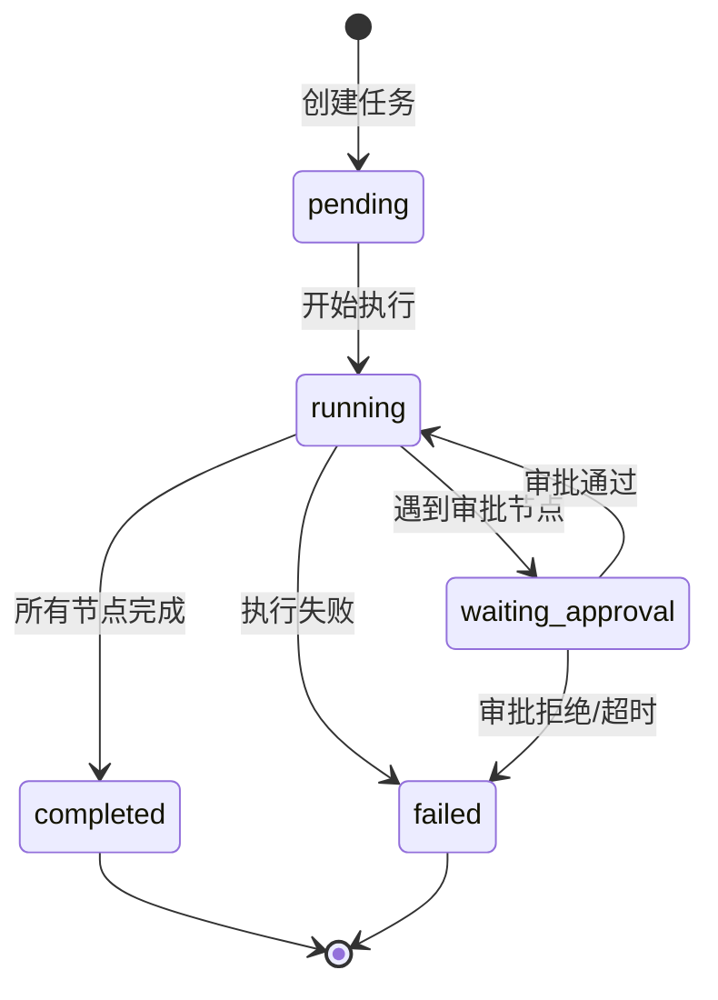

# 工作流域实体定义

## 核心实体

### Workflow - 工作流

| 字段 | 类型 | 说明 |
|------|------|------|
| id | string (UUID) | 主键 |
| name | string | 工作流名称 |
| description | string | 描述 |
| nodes | string (JSON) | 节点数组序列化 |
| edges | string (JSON) | 边数组序列化 |
| agent_configs | string (JSON) | Agent 配置 |
| is_template | number | 是否为模板 (0/1) |
| created_at | datetime | 创建时间 |
| updated_at | datetime | 更新时间 |

### WorkflowNode - 工作流节点

| 字段 | 类型 | 说明 |
|------|------|------|
| id | string | 节点 ID |
| type | string | 节点类型 (agent/approval) |
| data.label | string | 显示名称 |
| data.agentId | string | Agent ID |
| data.allowFailure | boolean | 是否允许失败 |
| data.approvalConfig | ApprovalConfig | 审批配置 |
| data.prompt | string | 提示词 |
| position.x | number | X 坐标 |
| position.y | number | Y 坐标 |

### WorkflowEdge - 工作流边

| 字段 | 类型 | 说明 |
|------|------|------|
| id | string | 边 ID |
| source | string | 源节点 ID |
| target | string | 目标节点 ID |
| animated | boolean | 是否动画 |

### Task - 执行任务

| 字段 | 类型 | 说明 |
|------|------|------|
| id | string (UUID) | 主键 |
| workflow_id | string | 关联工作流 |
| name | string | 任务名称 |
| status | string | 状态 (pending/running/completed/failed/waiting_approval) |
| start_time | datetime | 开始时间 |
| end_time | datetime | 结束时间 |
| current_node_id | string | 当前执行节点 |
| execution_order | string (JSON) | 执行顺序 |
| node_results | string (JSON) | 节点执行结果 |
| context | string (JSON) | 执行上下文 |
| logs | string (JSON) | 执行日志 |
| report_id | string | 关联报告 |

### ApprovalRequest - 审批请求

| 字段 | 类型 | 说明 |
|------|------|------|
| id | string (UUID) | 主键 |
| task_id | string | 关联任务 |
| node_id | string | 关联节点 |
| node_label | string | 节点名称 |
| description | string | 审批描述 |
| status | string | 状态 (pending/approved/rejected/timeout) |
| requested_by | string | 请求人 |
| approved_by | string | 审批人 |
| approved_at | datetime | 审批时间 |
| reject_reason | string | 拒绝原因 |
| timeout_at | datetime | 超时时间 |
| timeout_action | string | 超时动作 (reject/wait) |

### ScheduledTask - 定时任务

| 字段 | 类型 | 说明 |
|------|------|------|
| id | string (UUID) | 主键 |
| name | string | 任务名称 |
| description | string | 描述 |
| schedule | string | Cron 表达式 |
| workflow_id | string | 关联工作流 |
| enabled | number | 是否启用 (0/1) |
| last_run | datetime | 上次执行时间 |
| last_status | string | 上次执行状态 |
| next_run | datetime | 下次执行时间 |

## 执行上下文

### ExecutionContext

```typescript
interface ExecutionContext {
  variables: Record<string, unknown>;
  previousResults: Array<{
    nodeId: string;
    status: string;
    output?: string;
    error?: string;
  }>;
  metadata: {
    taskId: string;
    workflowName: string;
    currentNodeId?: string;
    executionDepth: number;
    startTime: string;
  };
}
```

### NodeResult

```typescript
interface NodeResult {
  status: 'success' | 'failed' | 'pending';
  output?: string;
  error?: string;
  metadata?: {
    thinkingProcess?: string;
    executionTime?: number;
  };
}
```

### PersistedExecutionState

审批暂停时保存的执行状态：

```typescript
interface PersistedExecutionState {
  workflowId: string;
  workflowName: string;
  initialInput?: string;
  executionOrder: string[];
  nodes: WorkflowNode[];
  edges: WorkflowEdge[];
  nodeResults: Record<string, NodeResult>;
  executionContext: ExecutionContext;
  pausedAtIndex: number;
}
```

## 状态流转图


