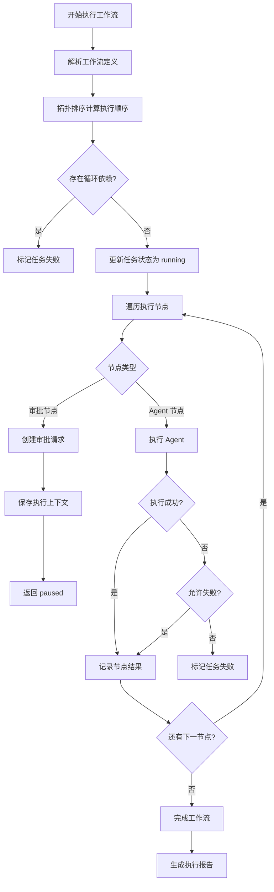
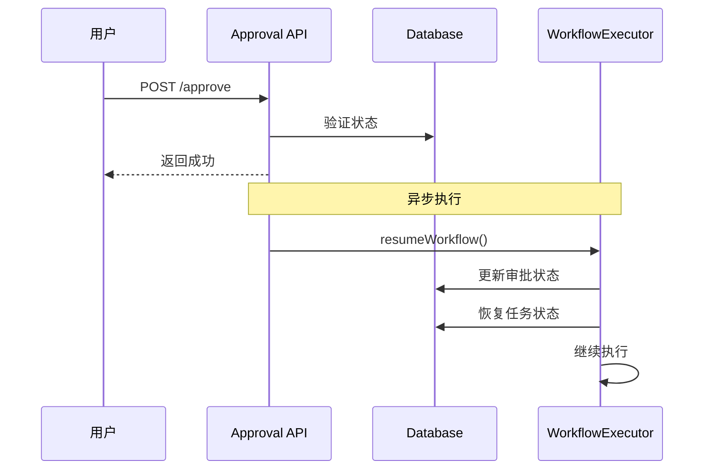
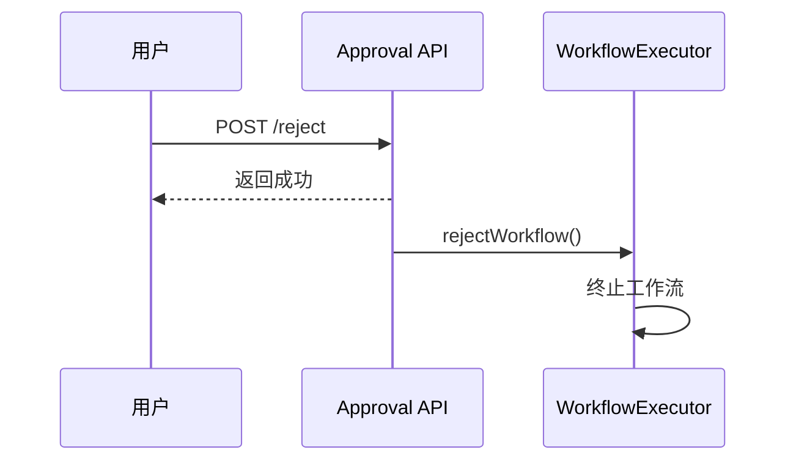
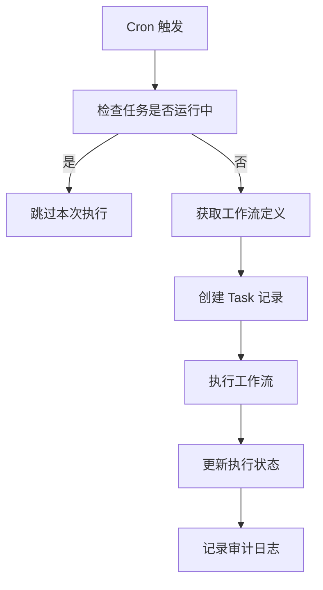
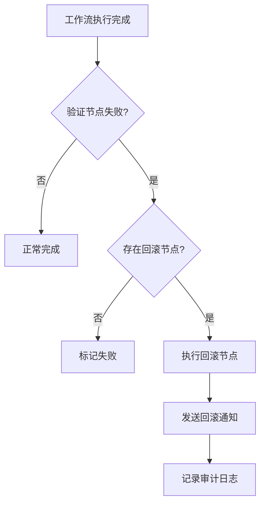

# 工作流域业务流程

## 工作流执行流程



## 审批处理流程

### 审批通过



### 审批拒绝



## 定时任务执行流程



## 验证失败自动回滚



## WebSocket 事件流

```
Client                    Server
  │                         │
  │──task:subscribe────────▶│
  │                         │
  │◀──task:started──────────│
  │◀──task:node:started─────│
  │◀──task:node:thinking────│
  │◀──task:node:output──────│
  │◀──task:node:completed───│
  │                         │
  │◀──task:approval:requested│
  │                         │  (等待审批)
  │                         │
  │◀──task:approval:resolved│
  │◀──task:completed────────│
  │                         │
```
